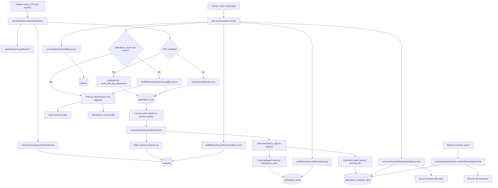

# Attendance Audit Flow

This document traces the full database path from student attendance sign-in to lecturer audit review and saved summary-file access.

## End-to-End Flow

## Write Path

1. Student attendance starts in `useAttendance.submitAttendance`.
2. The active session is resolved from `sessions` by OTP.
3. The preferred write path is the `verify_and_log_attendance` RPC.
4. The fallback write path inserts directly into `attendance_logs` through `attendanceRepository.log`.
5. When the lecturer ends the session, or the session expires, `sessionRepository.finalizeSession` reads those `attendance_logs` rows.
6. Finalization writes deduped audit rows into `attendance_audit` and also persists a session summary file into `attendance_summary_files`.
7. The session row is archived by writing `archived_at` on `sessions`.

## Read Path

1. The lecturer audit page loads the lecturer's classes, sessions, audit logs, and saved summary files.
2. If persisted `attendance_audit` rows exist, the page uses them as the source of truth.
3. If they do not exist yet, the page falls back to live `attendance_logs` rows.
4. The UI filters both summaries and records by `classId` and `sessionId`, then paginates the filtered result sets.
5. Saved summary files are read from `attendance_summary_files` and can be reopened directly without rebuilding them.

## Stored Tables Involved

- `sessions`: active and archived lecturer sessions.
- `attendance_logs`: raw sign-in events.
- `attendance_audit`: persisted audit history copied from `attendance_logs`.
- `attendance_summary_files`: persisted summary files that can be reopened later.
- `classes`: lecturer-owned class metadata used for class filtering.
- `profiles`: student profile data used to enrich audit rows.